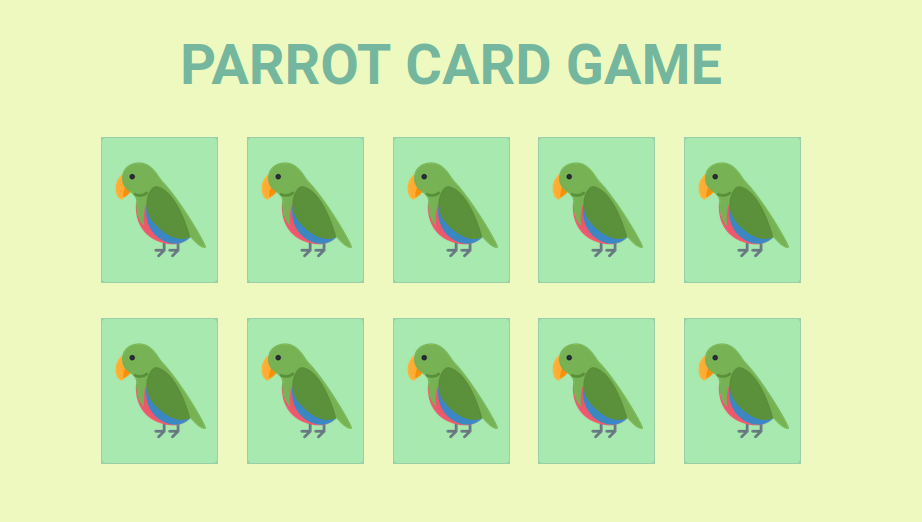
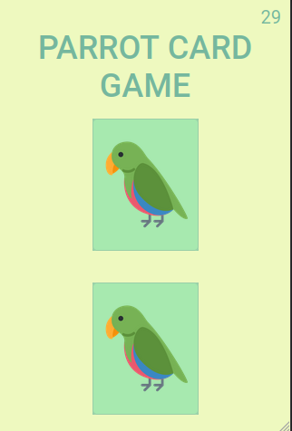
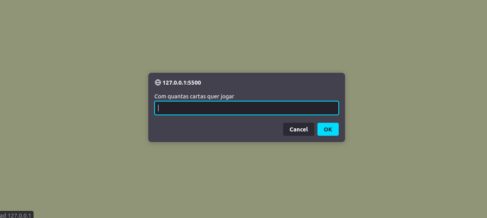
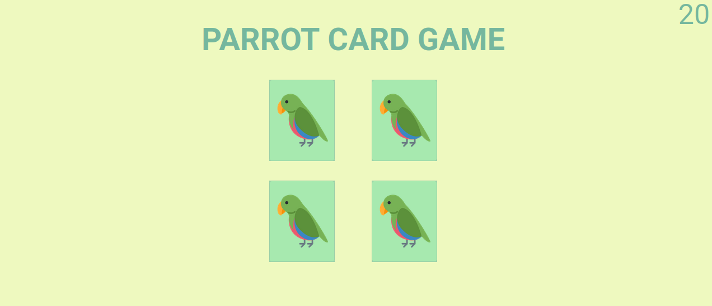
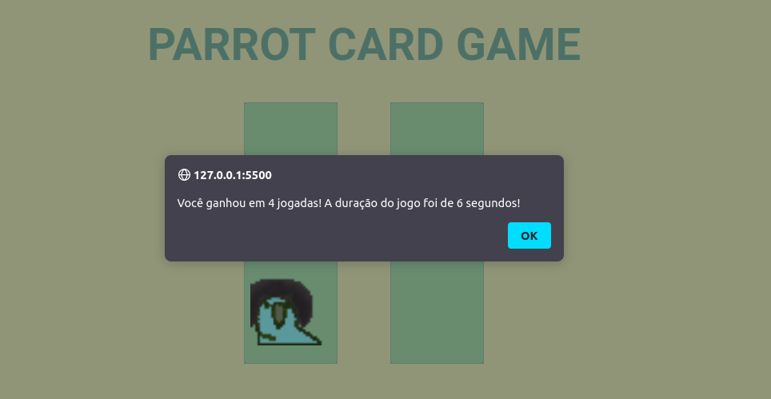
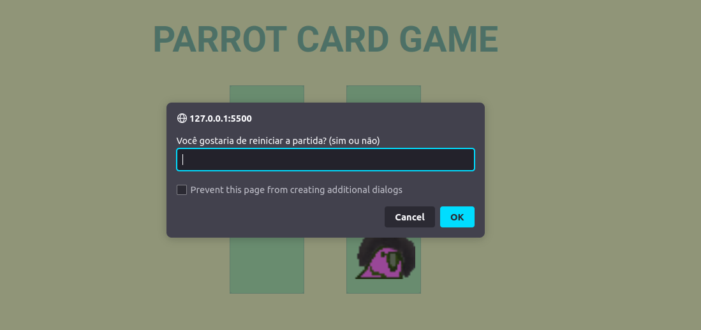

# 💻 projeto4-parrots

## Sobre
Jogo Parrot Card Game, é um jogo da memória temático com aleatoriedade, efeitos e transição, responsividade e papagaios dançantes!

## 🚀 Tecnologias

Esse projeto foi desenvolvido com as seguintes tecnologias:

- [html](https://html.com/)
- [css](https://www.w3.org/Style/CSS/Overview.en.html)
- [javascript](https://www.javascript.com/)

## 🚀 Resultado

- Aplicar layout para desktop e mobile, seguindo o Figma..
**Desktop**

**Mobile**

- Ao entrar no jogo, o usuário deverá ser perguntado com quantas cartas quer jogar.

- O usuário só poderá inserir números pares no prompt, de 4 a 14. Qualquer número que fuja dessa regra não deve ser aceito. No caso de números inválidos, o prompt deverá ficar sendo repetido em loop, até que o usuário coloque um número válido.

- Após inserir um número de cartas válido, o jogo deverá inserir as cartas viradas pra baixo na página de forma que a distribuição seja aleatória.

- Ao clicar em uma carta, ela deve ser virada.

- Quando o usuário terminar de virar todas as cartas corretamente, deverá ser exibido um alert com a mensagem Você ganhou em X jogadas!, sendo X a quantidade de vezes que o usuário virou uma carta no jogo, ou seja, cada carta virada é uma jogada, não é virar duas cartas que é uma jogada.

**Relogio**

- Existe um relógio no topo superior direito da tela, contando quantos segundos já passaram desde o início do jogo.

- Ao final do jogo é mostrada uma mensagem de vitória acrescida do tempo que o usuário levou pra finalizar o jogo, no seguinte formato: **Você ganhou em X jogadas! A duração do jogo foi de Y segundos!**.

**Reinicio do Jogo**
Ao final do jogo, após o alert de vitória, se pergunta com um prompt se o usuário gostaria de reiniciar a partida.

